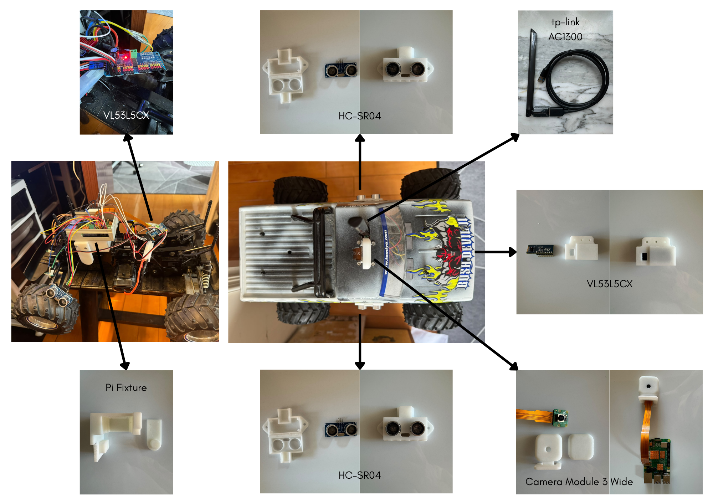

# RC Car ROS2 Project

An autonomous RC car built with **ROS 2 Jazzy**, **Raspberry Pi 5**, and a web-based control interface.


## Features

- **Real-time Web Control** — Control steering and throttle via browser (phone-friendly)
- **Live Camera Streaming** — Stream video from Raspberry Pi Camera Module 3 Wide
- **Multi-Sensor System** — VL53L5CX (ToF) + dual HC-SR04 ultrasonic sensors
- **Field Mode** — Built-in WiFi hotspot for outdoor operation (no home router needed)
- **ROS2 Architecture** — Web Server Node, Brain Node, Sensors Node, Movement Node
- **3D Printed Mounts** — Custom fixtures for Pi, camera, and sensors

## Media & Demo

### Hardware Assembly


### Demo Video
Watch the RC car being controlled in real-time via the web interface:

[▶️ Watch Demo Video](https://github.com/fw1015/rc-car-ros2/releases/download/v1.0/RC_Control.mp4)

---

## Tech Stack

- **ROS 2 Jazzy** (Ubuntu 24.04)
- **Raspberry Pi 5** + Camera Module 3 Wide
- **Python** + Flask (web interface)
- **gpiozero** + LGPIO (hardware control)
- **SolidWorks** (3D design)

## Project Structure

```bash
rc-car-ros2/
├── src/
│   ├── web_interface/            # Flask web server + frontend
│   ├── robot_brain/              # Decision making & safety logic
│   ├── robot_movement/           # Servo and ESC control nodes
│   ├── robot_sensors/            # ToF + Ultrasonic sensor nodes
│   └── camera_ros/               # Camera streaming node
├── docs/
│   ├── images/                   # Hardware photos and diagrams
│   └── hardware_architecture.md  # Hardware mapping and pin connections
├── hardware/
│   └── 3d_models/                # STL files for 3D printed parts
├── .gitignore
└── README.md